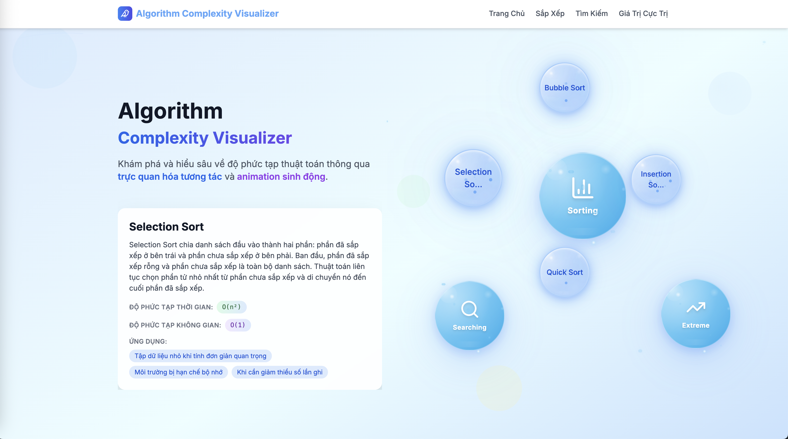

# Web Minh Họa Độ Phức Tạp Thuật Toán

## Giao diện trang chủ


**Nền tảng minh họa tương tác để hiểu độ phức tạp thuật toán**

Ứng dụng web giáo dục được xây dựng bằng Next.js, React, TypeScript và TailwindCSS, cung cấp các minh họa tương tác cho nhiều thuật toán khác nhau bao gồm sắp xếp, tìm kiếm và tìm giá trị cực trị.

## Tính Năng

### Trang Chủ Tương Tác
- **Bong Bóng Hoạt Hình 3D**: Ba bong bóng nổi đại diện cho các danh mục thuật toán khác nhau
- **Hoạt Hình Mượt Mà**: Được xây dựng với Framer Motion cho các hiệu ứng chuyển cảnh đẹp mắt
- **Thiết Kế Responsive**: Hoạt động liền mạch trên mọi kích cỡ thiết bị

### Thuật Toán Sắp Xếp
- **Bubble Sort**: Thuật toán so sánh đơn giản với độ phức tạp O(n²)
- **Selection Sort**: Tìm phần tử nhỏ nhất và đặt ở đầu
- **Insertion Sort**: Xây dựng mảng đã sắp xếp từng phần tử một
- **Quick Sort**: Thuật toán chia để trị với độ phức tạp trung bình O(n log n)
- **Merge Sort**: Thuật toán sắp xếp ổn định với hiệu suất đảm bảo O(n log n)

### Thuật Toán Tìm Kiếm
- **Linear Search**: Tìm kiếm tuần tự qua mảng chưa sắp xếp - O(n)
- **Binary Search**: Tìm kiếm hiệu quả cho mảng đã sắp xếp - O(log n)
- **Jump Search**: Tìm kiếm nhảy bước với độ phức tạp - O(√n)
- **Interpolation Search**: Tìm kiếm nội suy cho dữ liệu phân bố đều - O(log log n)

**Lưu ý**: Jump Search và Interpolation Search yêu cầu dữ liệu đã được sắp xếp để hoạt động chính xác.

### Tìm Giá Trị Cực Trị
- **Linear Min/Max**: Quét đơn giản để tìm giá trị nhỏ nhất và lớn nhất - O(n)
- **Tournament Method**: Phương pháp đấu loại trực tiếp để tìm giá trị cực trị - O(n)
- **Divide & Conquer Min/Max**: Thuật toán chia để trị tối ưu số lần so sánh - O(n)

### Test Case & Dữ Liệu Tùy Chỉnh
- **Test Case Thông Minh**: Hệ thống test case tự động cho mỗi thuật toán
  - **Best Case**: Dữ liệu tối ưu cho thuật toán (VD: mảng đã sắp xếp cho Insertion Sort)
  - **Average Case**: Dữ liệu ngẫu nhiên điển hình
  - **Worst Case**: Dữ liệu tệ nhất (VD: mảng đảo ngược cho Bubble Sort)
- **Nhập Mảng Tùy Chỉnh**: Nhập mảng của riêng bạn để test với dữ liệu cụ thể
  - Hỗ trợ nhiều định dạng: dấu phẩy, khoảng trắng, dấu chấm phẩy
  - Validation tự động: kiểm tra số hợp lệ, phạm vi giá trị
  - Thông báo lỗi rõ ràng

### Benchmark Hiệu Suất
- **So Sánh Nhiều Thuật Toán**: Chạy và so sánh hiệu suất của nhiều thuật toán cùng lúc
- **Đo Lường Chi Tiết**: Theo dõi thời gian thực thi, số lần so sánh, và bộ nhớ sử dụng
- **Ước Lượng Bộ Nhớ**: Tính toán memory usage dựa trên input size, auxiliary arrays, recursion depth
- **Biểu Đồ Trực Quan**: Xem kết quả benchmark qua biểu đồ và bảng thống kê
- **Tùy Chỉnh Input**: Chọn kích thước dữ liệu và loại dữ liệu (ngẫu nhiên, đã sắp xếp, đảo ngược)
- **Export Dữ Liệu**: Xuất kết quả benchmark ra CSV/JSON để phân tích sâu hơn

### Lý Thuyết Thuật Toán
- **Cơ Sở Lý Thuyết**: Học các khái niệm cơ bản về phân tích thuật toán
- **Công Thức Toán Học**: Hiển thị công thức với LaTeX rendering
- **Ví Dụ Chi Tiết**: Các ví dụ minh họa cụ thể cho từng khái niệm
- **Kiến Thức Nền Tảng**: Big-O notation, độ phức tạp, phân tích worst/best/average case

## Điều Khiển Tương Tác

### Tính Năng Minh Họa
- **Phát/Tạm Dừng/Đặt Lại**: Toàn quyền kiểm soát việc thực thi thuật toán
- **Điều Khiển Tốc Độ**: Điều chỉnh tốc độ hoạt hình từ 0.25x đến 20x
- **Điều Hướng Từng Bước**: Thực hiện thủ công từng bước của thuật toán
- **Nhập Mảng Tùy Chỉnh**: Nhập mảng riêng để test thuật toán với dữ liệu cụ thể
- **Mảng Ngẫu Nhiên**: Tạo mảng ngẫu nhiên mới hoặc điều chỉnh kích thước mảng
- **Test Case Thông Minh**: Chọn test case best/average/worst để so sánh hiệu suất
- **Chọn Mục Tiêu**: Đối với thuật toán tìm kiếm, chọn giá trị cần tìm

### Yếu Tố Giáo Dục
- **Mã Với Cú Pháp Nổi Bật**: Xem code implementation bằng 6 ngôn ngữ lập trình
- **Phân Tích Độ Phức Tạp**: Hiểu độ phức tạp thời gian và không gian chi tiết
- **Minh Họa Mã Màu**: Màu sắc khác nhau cho các trạng thái khác nhau (đang so sánh, tìm thấy, đã loại bỏ)
- **Test Case Thông Minh**: So sánh best case, average case, và worst case của từng thuật toán
- **Đếm Phép Toán Chính Xác**: Đếm số lần so sánh, hoán đổi, gán một cách chính xác theo lý thuyết
- **Ứng Dụng Thực Tế**: Học khi nào sử dụng thuật toán nào trong thực tế
- **Thống Kê Thời Gian Thực**: Theo dõi số lần so sánh, thời gian thực thi, và bộ nhớ sử dụng
- **Memory Analysis**: Hiểu cách thuật toán sử dụng bộ nhớ và tối ưu hóa không gian

### Hỗ Trợ Đa Ngôn Ngữ Lập Trình
Tất cả 12 thuật toán đều có code mẫu đầy đủ bằng 6 ngôn ngữ lập trình:
- **JavaScript**: Cú pháp hiện đại ES6+
- **Java**: Phiên bản thân thiện với OOP
- **C++**: Sử dụng STL và modern C++
- **C#**: Tuân theo coding conventions của .NET
- **C**: Implementation thuần túy, tối ưu hiệu suất
- **Python**: Cú pháp đơn giản, dễ đọc

Mỗi code sample đều:
- ✅ Được syntax highlighting với Prism.js
- ✅ Có comment giải thích rõ ràng
- ✅ Tuân theo best practices của từng ngôn ngữ
- ✅ Dễ dàng copy và sử dụng trong dự án thực tế

## Công Nghệ Sử Dụng

### Core Technologies
- **Next.js 14** - Framework React với App Router và tối ưu hóa hiệu suất
- **React 18** - Thư viện UI với hooks và concurrent features
- **TypeScript 5** - Type-safe development

### Styling & Animation
- **TailwindCSS 3.4** - Utility-first CSS framework cho thiết kế responsive
- **Framer Motion** - Thư viện animation mượt mà và tương tác
- **Anime.js** - Animation engine cho hiệu ứng phức tạp

### Visualization & Display
- **Prism.js** - Syntax highlighting cho code samples đa ngôn ngữ
- **KaTeX** - Render công thức toán học LaTeX
- **Recharts** - Biểu đồ và charts cho kết quả benchmark
- **Lucide React** - Bộ icon hiện đại và nhất quán

### Performance Optimization
- **SWC Compiler** - Rust-based compiler siêu nhanh
- **React Intersection Observer** - Lazy loading và viewport detection
- **Code Splitting** - Tự động chia nhỏ bundle theo route

## Bắt Đầu

### Yêu Cầu Tiên Quyết
- Node.js 18+ 
- npm hoặc yarn

### Cài Đặt

1. **Clone repository**
   ```bash
   git clone <repository-url>
   cd algorithm-complexity-visualizer
   ```

2. **Cài đặt dependencies**
   ```bash
   npm install
   ```

3. **Chạy development server**
   ```bash
   npm run dev
   ```

4. **Mở trình duyệt**
   Điều hướng đến [http://localhost:3000](http://localhost:3000)

## Cấu Trúc Dự Án

```
src/
├── app/                          # Trang Next.js App Router
│   ├── algorithms/
│   │   └── [category]/
│   │       ├── page.tsx         # Trang danh sách danh mục
│   │       └── [algorithm]/
│   │           └── page.tsx     # Trang chi tiết thuật toán
│   ├── benchmark/
│   │   └── page.tsx             # Trang benchmark hiệu suất
│   ├── theory/
│   │   └── page.tsx             # Trang lý thuyết thuật toán
│   ├── error.tsx                # Trang lỗi
│   ├── loading.tsx              # Trang loading
│   ├── globals.css              # Styles toàn cục
│   ├── layout.tsx               # Layout gốc
│   ├── icon.svg                 # Favicon
│   └── page.tsx                 # Trang chủ
├── components/                   # Các component React có thể tái sử dụng
│   ├── AlgorithmBubble.tsx      # Bong bóng thuật toán trên trang chủ
│   ├── AlgorithmInfo.tsx        # Hiển thị thông tin thuật toán
│   ├── AnimatedBubble.tsx       # Component bong bóng hoạt hình
│   ├── ArrayInput.tsx           # Component nhập mảng tùy chỉnh
│   ├── BackgroundEffects.tsx    # Hiệu ứng nền
│   ├── BenchmarkLab.tsx         # Lab thử nghiệm benchmark
│   ├── BenchmarkResults.tsx     # Hiển thị kết quả benchmark với biểu đồ
│   ├── CanvasBackgroundEffects.tsx # Hiệu ứng nền canvas
│   ├── CodeBlock.tsx            # Trình xem mã với cú pháp nổi bật
│   ├── DetailedTimingTable.tsx  # Bảng thống kê chi tiết với memory tracking
│   ├── ExtremeValueVisualizer.tsx # Trình minh họa thuật toán Min/Max
│   ├── Header.tsx               # Header điều hướng
│   ├── LaTeX.tsx                # Render công thức toán học LaTeX
│   ├── LazyLoad.tsx             # Component lazy loading
│   ├── OptimizedAnimation.tsx   # Hoạt hình tối ưu
│   ├── OptimizedBackgroundEffects.tsx # Hiệu ứng nền tối ưu
│   ├── OptimizedBar.tsx         # Thanh bar tối ưu hiệu suất
│   ├── SearchingVisualizer.tsx  # Trình minh họa thuật toán tìm kiếm
│   ├── SortingVisualizer.tsx    # Trình minh họa thuật toán sắp xếp
│   └── TestCaseSelector.tsx     # Component chọn test case
├── hooks/                       # Custom React Hooks
│   └── usePerformanceOptimization.ts # Hook tối ưu hiệu suất
├── lib/                         # Hàm tiện ích và dữ liệu
│   ├── algorithms.ts            # Định nghĩa và metadata thuật toán
│   ├── algorithmUtils.ts        # Triển khai thuật toán với các bước
│   ├── benchmarkEngine.ts       # Engine đo lường hiệu suất với memory tracking
│   ├── codeLanguages.ts         # Định nghĩa ngôn ngữ lập trình
│   ├── codeSamples.ts           # Code mẫu cho 6 ngôn ngữ lập trình
│   ├── instrumentation.ts       # Công cụ đo lường, theo dõi và memory estimation
│   ├── instrumentedAlgorithms.ts # Thuật toán với instrumentation và memory tracking
│   ├── testCases.ts             # Test cases cho best/average/worst scenarios
│   └── theoryDatabase.ts        # Cơ sở dữ liệu lý thuyết
└── types/                       # Định nghĩa kiểu TypeScript
    ├── algorithm.ts             # Các kiểu liên quan đến thuật toán
    ├── instrumentation.ts       # Các kiểu cho instrumentation và memory tracking
    └── theory.ts                # Các kiểu cho lý thuyết
```

## Hệ Thống Thiết Kế

### Bảng Màu
- **Chính**: Tông màu xanh dương cho các yếu tố giao diện chính
- **Thành Công**: Xanh lá cho trạng thái hoàn thành/đúng
- **Cảnh Báo**: Vàng cho trạng thái so sánh/hiện tại
- **Nguy Hiểm**: Đỏ cho trạng thái đổi chỗ/lỗi
- **Tím**: Cho các yếu tố đặc biệt (pivot, giữa, v.v.)

### Nguyên Tắc Hoạt Hình
- **Chuyển Cảnh Mượt Mà**: Tất cả thay đổi trạng thái đều được hoạt hình
- **Hiệu Suất**: Hoạt hình được tối ưu hóa không làm chặn UI
- **Kiểm Soát Người Dùng**: Người dùng có thể kiểm soát tốc độ hoạt hình và tạm dừng/tiếp tục

## Mục Tiêu Giáo Dục

Nền tảng này giúp sinh viên và lập trình viên:

1. **Minh Họa Khái Niệm Trừu Tượng**: Xem cách thuật toán hoạt động từng bước
2. **Hiểu Độ Phức Tạp**: Học ký hiệu Big-O qua ví dụ thực tế
3. **So Sánh Thuật Toán**: Xem các cách tiếp cận khác nhau giải quyết cùng một vấn đề
4. **Luyện Tập Giải Quyết Vấn Đề**: Hiểu khi nào sử dụng thuật toán nào

## Kết Quả Học Tập Chính

- **Phân Tích Thuật Toán**: Hiểu độ phức tạp thời gian và không gian
- **Memory Analysis**: Hiểu cách thuật toán sử dụng bộ nhớ và tối ưu hóa không gian
- **Mẫu Giải Quyết Vấn Đề**: Nhận biết chia để trị, cách tiếp cận tham lam
- **Đánh Đổi Hiệu Suất**: Khi nào ưu tiên thời gian vs không gian vs tính ổn định
- **Benchmark Analysis**: So sánh hiệu suất thực tế giữa các thuật toán
- **Ứng Dụng Thực Tế**: Nơi các thuật toán này được sử dụng trong thực tế

## Tùy Chỉnh

### Thêm Thuật Toán Mới

1. **Định nghĩa thuật toán** trong `src/lib/algorithms.ts`
2. **Triển khai logic từng bước** trong `src/lib/algorithmUtils.ts`
3. **Thêm instrumented version** trong `src/lib/instrumentedAlgorithms.ts` với memory tracking
4. **Thêm case handling** trong `src/lib/benchmarkEngine.ts` cho benchmark
5. **Thêm code samples** cho 6 ngôn ngữ trong `src/lib/codeSamples.ts`
6. **Thêm test cases** (best/average/worst) trong `src/lib/testCases.ts`
7. **Thêm logic minh họa** vào component visualizer thích hợp
8. **Cập nhật routing** nếu cần

### Chỉnh Sửa Minh Họa

Các component visualizer có tính module và có thể dễ dàng tùy chỉnh:
- Thay đổi màu sắc trong hàm `getElementColor`
- Điều chỉnh thời gian hoạt hình trong các lời gọi `delay`
- Chỉnh sửa layout trong cấu trúc JSX

## Thiết Kế Responsive

- **Phương pháp mobile-first**: Tối ưu cho màn hình nhỏ trước
- **Layout linh hoạt**: Grid và flexbox cho components responsive
- **Thân thiện với cảm ứng**: Tất cả yếu tố tương tác hoạt động trên thiết bị cảm ứng
- **Typography dễ đọc**: Kích thước font và tỷ lệ tương phản phù hợp

## Tối Ưu Hiệu Suất

- **Chia nhỏ mã**: Tự động chia nhỏ mã dựa trên route
- **Lazy loading**: Components tải khi cần
- **Hoạt hình tối ưu**: Hoạt hình dựa trên RAF cho hiệu suất mượt mà
- **Quản lý bộ nhớ**: Dọn dẹp timer hoạt hình đúng cách
- **Memory Tracking**: Ước lượng và theo dõi memory usage của các thuật toán
- **Benchmark Optimization**: Batch processing và progress tracking cho benchmark lớn

## Tính Năng Mới

### Memory Usage Tracking
- **Ước lượng bộ nhớ**: Tính toán memory usage dựa trên input size, auxiliary arrays, recursion depth
- **Memory visualization**: Hiển thị memory usage trong biểu đồ và bảng thống kê
- **Format memory**: Chuyển đổi bytes sang B/KB/MB/GB cho dễ đọc
- **Memory comparison**: So sánh memory usage giữa các thuật toán

### Enhanced Benchmark
- **Memory metrics**: Thu thập và hiển thị memory usage trong benchmark
- **Export memory data**: Xuất memory data ra CSV/JSON
- **Memory-aware algorithms**: Tất cả 11 thuật toán đều có memory tracking
- **Space complexity analysis**: Hiểu độ phức tạp không gian thực tế
